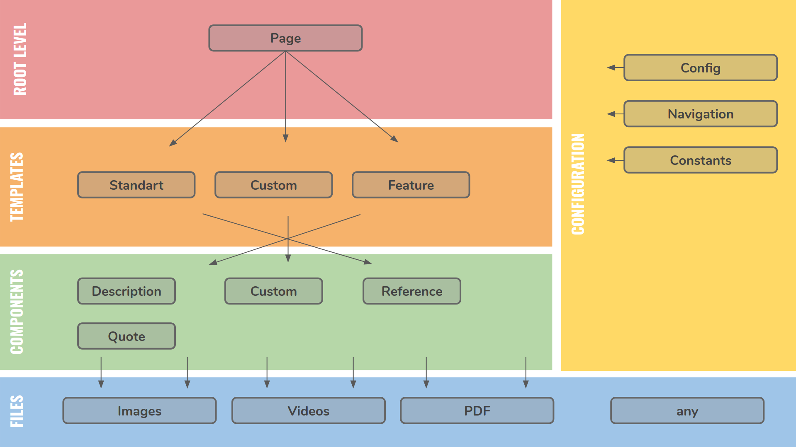

# Headless CMS (Contentful) and NextJS: How to create a modern React application?

## Post Complementary Application

The post you can read [here](https://medium.com/@FocusReactive/headless-cms-contentful-and-nextjs-how-to-create-a-modern-react-application-part-1-fdd772073a5d)

---
 Contentful - Modern headless CMS promoting API-first and cloud-native approaches

---

  NextJS - Modern React based framework with Server Side Rendering and file system based router out of the box.

---

### Building a hierarchical content model

let's establish a hierarchical structure of the application content model that has the following three levels of components:

- page
- template
- component

We'll also be using components like config in order to modify the behavior of the available types and to store general information about the application. The references to files stored in CMS will be added to our components. These files can be considered as an additional hierarchical level of a lower rank.




### How to start

```sh
git clone https://github.com/UsulPro/contentful-post-demo-app.git
cd contentful-post-demo-app
yarn
yarn server
```

### Created by

[Oleg Proskurin](https://twitter.com/UsulPro)

Senior Software Engineer @ [FocusReactive](focusreactive.com)


### Import into contentful
In order to import into contentful update package.json and replace CONTENTFUL_SPACE_ID with your Space ID and CFPAT-CM=API-KEY with you Content Management API Key. 
